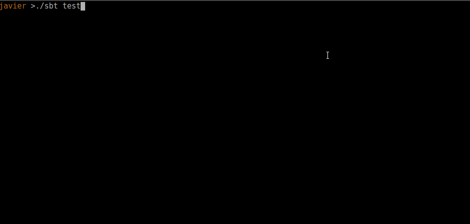
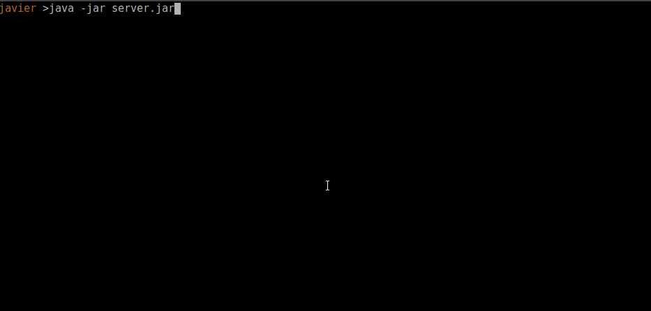
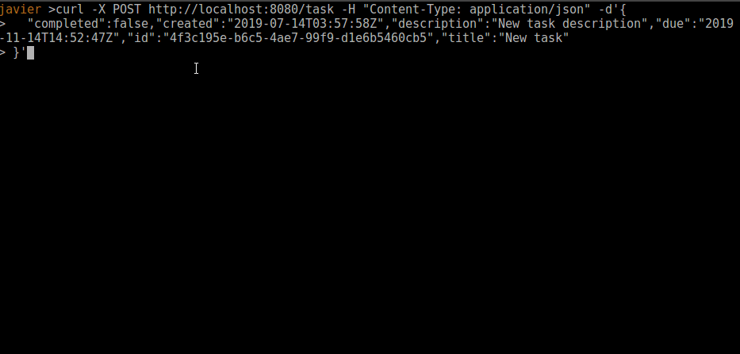

# Task management REST API template

This REST API powered by Spray and persistence on Slick allows users to create, 
update and list tasks on a simple TODO manager app. 

The main purpose of this project is to server as template for future Scala REST APIs.


Libraries and frameworks: 
- Scala 2.12.8
- Akka-http: REST api
- Slick 3: Persistence
- Postgres/H2: Database drivers
- Flyway: To run DB migrations
- Specs2: Testing framework

## Endpoints

- GET /task list all tasks
- GET /task/[id] get task by id
- POST /task create new task 
- PUT /task/[id] update an existing task 
- DELETE /task/[id]

Extra endpoints for monitoring, useful when implementing a complex microservice stack:
- GET / return status and name of the app 
- GET /ping pong 

## Features 

- Database migrations using slick 
- task endpoints
- Status endpoints
- Postgres database on docker when running server, but H2 database for tests
- Added pagination (limit, from filters) on list of tasks endpoint
- Comprehensive test coverage on tests, DB methods, API and serializers

### Project structure
This is the structure of the modules in the project, it follows the model-view-controller pattern.

- src/main/resources/db : Folder with all migrations tu run with Flyway
- src/main/resources/application.conf: Configuration file for the server
- src/main/scala/todo: Where the code of the app is 
    - Webserver: App entrypoint, we run DB migrations and initialize the Spray REST API service
    - controller: contains the endpoints, and their actions, response serialization happens implicitly
    - model: contains the classes and the DB mapping
    - view: contains the JSON serializers
    - service: contains the DB acctions (insert, select, update, delete...)

All tests are inside src/test/scala/todo, following a similar model-view-controller structure. There is also another application.conf file with the H2 database details only for tests.
Plus, there is an additional `factory` pakcage for generating random objects (Account and task) with filled fields 

## Implementation comments

This is the list of this that I did or didn't do, most of them don't provide any value to the showcase of this project, but they are used to simplify the implementation. 

- DB in postgres "todo" is created on startup with the init.sql script on docker

- I'm generating randomStrings and randomFloats on every field on data and tests that are required, in order to avoid hardcoded false positives and import data faster. 
Check Factory package on tests for more details

## Things to do next 

This is a list of this that should be done before moving to a full environment. 

- Add security to API (uses profiles, access token, private network...)
- Filter task results on queryparams 
- Version API 
- Add error reporting system (eg: Sentry)
- Add swagger and external documentation on API
- continuous integration / continuous deploy
- BDD 

## Testing



Run all test

    ./sbt test 

Run a particular test (regex) 

    ./sbt 'test-only *Serializer*' 

Or use docker instead 

    docker-compose run todo bash -c "./sbt test"

## Run the server 


Before running the server, you will need to be running a postgres instance with a *todo* database, you can run it on your machine using docker with 

    docker-compose up postgres 

Run with docker 

    docker-compose up todo

Or use the already built java jar (sbt assembly)

    java -jar server.jar
    


You could also use `./sbt run` but you need to change the application.conf to use postgres on localhost


## Sample usage: create a task 



PK id UUID is generated automatically
```
curl -X POST http://localhost:8080/task -H "Content-Type: application/json" -d'{
  "completed":false,"created":"2019-07-14T03:57:58Z","description":"New task description","due":"2019-11-14T14:52:47Z","id":"4f3c195e-b6c5-4ae7-99f9-d1e6b5460cb5","title":"New task"
}'
```
